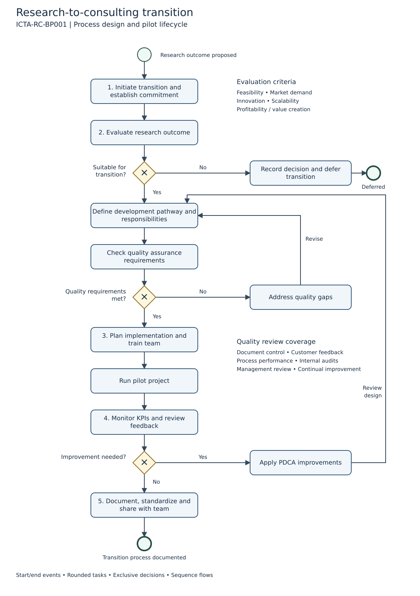

# Research-to-consulting process

**Process ID:** ICTA-RC-BP001  
**Original process designer:** Atdhe Buja  
**Source:** ICTA-RC-BP001_ICTA, dated February 2024  

## Purpose and scope

This model describes the design and pilot lifecycle for transitioning research outcomes toward consulting services. The source identifies five phases: initiation and commitment; analysis and design; implementation and training; monitoring and improvement; documentation and standardization. It does not specify a complete client sales or service-delivery process.

## What the slides establish

- Evaluation criteria: feasibility, market demand, innovation, scalability, and profitability or value creation.
- Design areas: development pathway, quality controls, roles and responsibilities.
- Quality topics: document control, customer satisfaction, process effectiveness, internal audits, management review, and continual improvement.
- Later phases: implementation planning, pilot work, KPI monitoring, PDCA improvement, process documentation, and team dissemination.

## Modeling decisions added in this reconstruction

The slides are a process-design outline, not an original BPMN execution export. The yes/no gateways, defer branch, quality-rework loop, improvement loop, and start/end events make the outline readable as BPMN. They are proposed routing interpretations for the author's review. No rejection thresholds or named approvers were supplied, so none were invented. Roles remain unassigned rather than being shown in unsupported swimlanes. The model is non-executable.

The end event means that the transition process has been documented after review. It does not mean that a client contract, production rollout, or commercial outcome occurred. Customer-feedback handling is represented within quality and monitoring activities, not as a separate client pool.

## Terminology

BPMN is the modeling notation. Business Process Analysis (BPA) examines processes and opportunities for improvement; it does not itself mean automation. ISO 9001 is a reference for quality-management principles, not evidence of certification. The deck's statement that BPA focuses on automating tasks should be corrected accordingly.

## Historical context

A separately supplied register screenshot has 2025 review dates and labels this process Under Design. It therefore cannot independently establish implementation during the January 2022–July 2024 CIO tenure. Any later register or reconstructed diagram should retain its actual date and context.

[Read the CIO article](https://www.atdheb.com/ict-academy-cio-case-study/)
